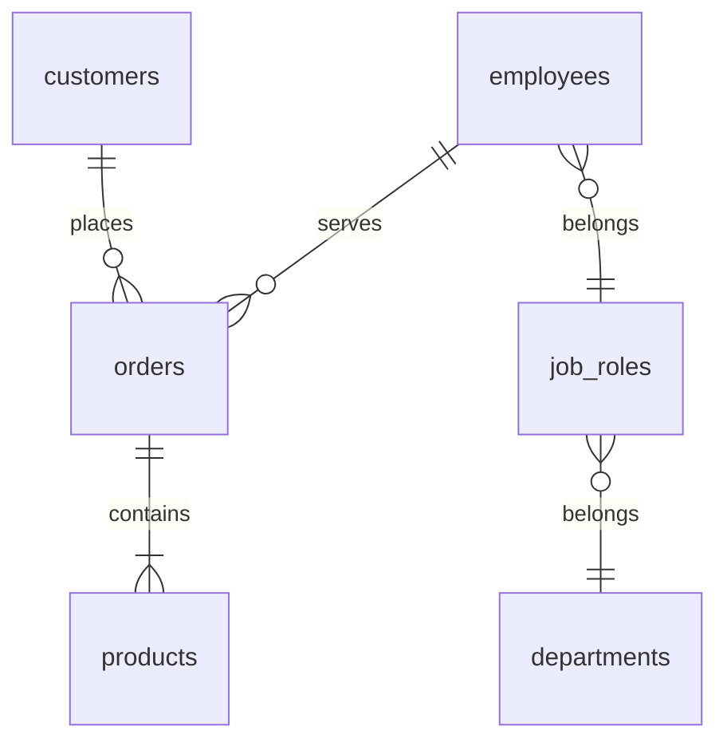
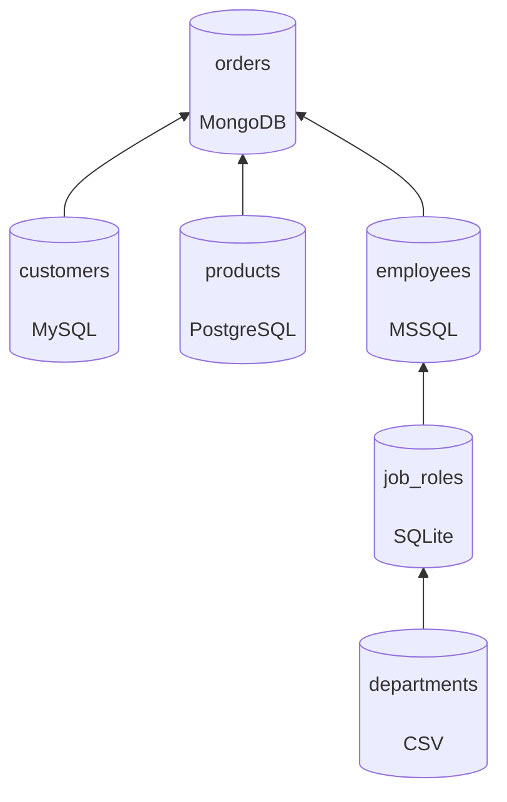

Major feature of a Datero data platform is its ability to join data from different sources within a single query.
In this tutorial we will demonstrate how Datero could empower your data analytics without any ETL development.

## Scenario
Let's assume we work for an imaginary `Enterprise` company.

As a usual company, it has multiple departments, like `Production`, `Sales`, `Finance`, etc.
Each department has its own data sources, like databases, spreadsheets, etc.
And there is a need to join data from different sources to get a complete picture of the company sales data.

This company has the following datasources:

- Customers are stored in `MySQL` database
- Products are stored in `PostgreSQL` database
- Employees are stored in `MSSQL` database
- Orders are stored in `MongoDB` database
- Job roles are stored in `SQLite` database
- Company departments are stored in `CSV` file

And we need to figure out in sales data who sold what product to which customer.
As well as what job role and department this employee belongs to.


## Logical Data Model
Below is a logical structure of data sources and their relations.
Sales data is stored in the `orders` table.
Customers place an orders which contain products. Employees serve the orders.
Employees belong to job roles and job roles belong to departments.



In terms of datasources, this diagram looks like this:



## Test Data
The data that are stored in each data source are as follow.

=== "customers"
    {{ read_csv('./data/tutorial/customers.csv') }}
=== "products"
    {{ read_csv('./data/tutorial/products.csv') }}
=== "orders"
    {{ read_csv('./data/tutorial/orders.csv') }}
=== "employees"
    {{ read_csv('./data/tutorial/employees.csv') }}
=== "job_roles"
    {{ read_csv('./data/tutorial/job_roles.csv') }}
=== "departments"
    {{ read_csv('./data/tutorial/departments.csv') }}


## Infrastructure Setup
!!! info "source files"
    All the sources used in this tutorial are available in the [demo](https://github.com/chumaky/datero-docs/tree/master/demo) folder of this documentation repository.

To emulate multiple data sources, we will use docker containers orchestrated by `docker-compose`.
It will spin up `datero` container and several other containers for relevant datasources.

??? abstract "docker-compose"
    ```yaml linenums="1"
    --8<-- "demo/docker-compose.yml"
    ```

Here is per-service breakdown of a compose file.
=== "datero"
    ```yaml linenums="1"
    --8<-- "demo/docker-compose.yml:datero"
    ```

    !!! info "Main datero container"
        Web ui is available on port `8080`.
        To distinguish from `postgres` datasource we run it on port `4444`.
        For `sqlite` and `csv` datasources we must mount them into the file system of this `datero` container.
        See corresponding service sections for detals.

=== "mysql"
    ```yaml linenums="1"
    --8<-- "demo/docker-compose.yml:mysql"
    ```

    !!! info "Customers data source"
        There is `finance` database is created.
        It will contain `customers` table defined via `mysql_customers.sql` setup script.
        Connection will be done over port `3306` under `mysql/mysql` user/password key pair.

=== "postgres"
    ```yaml linenums="1"
    --8<-- "demo/docker-compose.yml:postgres"
    ```

    !!! info "Products data source"
        There is `factory` database is created.
        It will contain `products` table defined via `postgres_products.sql` setup script.
        Connection will be done over port `5432` under `postgres/postgres` user/password key pair.

=== "mongo"
    ```yaml linenums="1"
    --8<-- "demo/docker-compose.yml:mongo"
    ```

    !!! info "Orders data source"
        There is `sales` database is created.
        It will contain `orders` collection defined via `mongo_orders.js` setup script.
        Connection will be done over port `27017` under `mongo/mongo` user/password key pair.

=== "mssql"
    ```yaml linenums="1"
    --8<-- "demo/docker-compose.yml:mssql"
    ```

    !!! info "Employess data source"
        There is `hr` database is created.
        It will contain `employees` table defined via `mssql_employees.sql` setup script.
        Connection will be done over port `1433` under `sa/Mssql_2019` user/password key pair.

        SQL Server initialization takes some time.
        To handle this gracefuly there are `mssql_entrypoint.sh` and `mssql_configure_db.sh` supplementary scripts are used.

=== "sqlite"
    ```yaml linenums="1" hl_lines="12"
    --8<-- "demo/docker-compose.yml:datero"
    ```

    !!! info "Job roles data source"
        SQLite database is single file based.
        It doesn't have any listener over some port to connect to.
        Hence, we must mount it inside the `datero` container to enable access to it through its file system.

        Database `sqlite_job_roles.db` will be mounted to the `/home/data` folder of the container as a `job_roles.db` file.
        It contains `job_roles` table defined via `sqlite_job_roles.sql` setup script from the `demo` folder.

=== "csv"
    ```yaml linenums="1" hl_lines="13"
    --8<-- "demo/docker-compose.yml:datero"
    ```

    !!! info "Departments data source"
        This is a file based resource.
        It doesn't have any listener over some port to connect to.
        To read the file, it must be accessible from local file system of the `datero` container.

        File `departments.csv` from sibling `data/tutorial` directory will be mounted to the `/home/data` folder of the container as `departments.csv` file.


To spin-up all the containers, clone this [docs](https://github.com/chumaky/datero-docs) repository and run the following command.
It will first fetch all the images if they are absent on your local registry and then start all the containers.

``` bash
docker-compose -f demo/docker-compose.yml up -d
```

After execution of this command, you should see output similar to below.
``` bash
$ docker ps
CONTAINER ID  IMAGE                                       COMMAND               CREATED             STATUS             PORTS                                         NAMES
db495bdfe319  docker.io/chumaky/datero:latest             supervisord -c /e...  About a minute ago  Up About a minute  0.0.0.0:4444->5432/tcp, 0.0.0.0:8080->80/tcp  datero_main
590a6adbaa2c  docker.io/library/mysql:latest              mysqld                About a minute ago  Up About a minute  0.0.0.0:3306->3306/tcp                        datero_mysql
5c3cba74112b  docker.io/library/postgres:alpine           postgres              About a minute ago  Up About a minute  0.0.0.0:5432->5432/tcp                        datero_postgres
d92ba333ba28  docker.io/library/mongo:latest              mongod                About a minute ago  Up About a minute  0.0.0.0:27017->27017/tcp                      datero_mongo
a797fbb12392  mcr.microsoft.com/mssql/server:2019-latest                        About a minute ago  Up About a minute  0.0.0.0:1433->1433/tcp                        datero_mssql
```

### Checking data sources
Let's check all our datasources to make sure they are running and have expected seed data.

=== "mysql"
    ``` bash
    $ docker exec datero_mysql mysql -umysql -pmysql -e "select * from finance.customers"
    id      name
    1       Tom
    2       Kate
    3       John
    ```

=== "postgres"
    ``` bash
    $ docker exec datero_postgres psql -d factory -U postgres -c "select * from products"
    id |  name  | price
    ----+--------+-------
      1 | apple  |     1
      2 | banana |   2.3
      3 | orange |   3.5
    (3 rows)
    ```

=== "mongo"
    ``` bash
    $ docker exec datero_mongo mongo -u mongo -pmongo --authenticationDatabase admin --eval "db.getSiblingDB('sales').orders.find()"
    MongoDB shell version v5.0.10
    connecting to: mongodb://127.0.0.1:27017/?authSource=admin&compressors=disabled&gssapiServiceName=mongodb
    Implicit session: session { "id" : UUID("21c19e50-0a03-4e92-aa99-126da29607d8") }
    MongoDB server version: 5.0.10
    { "_id" : ObjectId("64cf8a76bee1f91da11ce665"), "id" : 1, "customer_id" : 1, "product_id" : 1, "employee_id" : 1, "quantity" : 10 }
    { "_id" : ObjectId("64cf8a76bee1f91da11ce666"), "id" : 2, "customer_id" : 1, "product_id" : 2, "employee_id" : 2, "quantity" : 2 }
    { "_id" : ObjectId("64cf8a76bee1f91da11ce667"), "id" : 3, "customer_id" : 1, "product_id" : 3, "employee_id" : 3, "quantity" : 5 }
    { "_id" : ObjectId("64cf8a76bee1f91da11ce668"), "id" : 4, "customer_id" : 2, "product_id" : 1, "employee_id" : 3, "quantity" : 5 }
    { "_id" : ObjectId("64cf8a76bee1f91da11ce669"), "id" : 5, "customer_id" : 2, "product_id" : 3, "employee_id" : 2, "quantity" : 3 }
    { "_id" : ObjectId("64cf8a76bee1f91da11ce66a"), "id" : 6, "customer_id" : 3, "product_id" : 1, "employee_id" : 3, "quantity" : 8 }
    ```

=== "mssql"
    ``` bash
    $ docker exec datero_mssql /opt/mssql-tools/bin/sqlcmd -S localhost -U sa -P Mssql_2019 -d hr -Q "select * from employees"
    id          name      job_id
    ----------- --------- -----------
              1 John                1
              2 Bob                 2
              3 Lisa                3
    ```

=== "sqlite"
    ``` bash
    $ sqlite3 -header -column demo/sqlite_job_roles.db "select * from job_roles"
    id  name      department_id
    --  --------  -------------
    1   owner     1
    2   manager   2
    3   salesman  3
    ```

=== "csv"
    ``` bash
    $ cat data/tutorial/departments.csv
    id,name
    1,management
    2,finance
    3,sales
    ```

We successfully connected to all the data sources and all of them have expected data.


## Datero setup
Now, when all the data sources are up and running, we can configure them in Datero ui.
Navigate to the [http://localhost:8080](http://localhost:8080) and you should see default Datero dashboard.
For more details about it, please refer to the [overview](overview.md) section.

<figure markdown>
  { loading=lazy }
  <figcaption>Datero dashboard</figcaption>
</figure>

As of now, we don't have any data sources defined yet. Let's add them one by one.

Detailed instructions how to add data sources for each supported connector could be found in the [connectors](../connectors) section.
We will not repeat them here, but instead will show how to add server and import schema whenever applicable for each of our datasources.

### Servers creation
In the left navigation pane of the dashboard in the Connectors section click on the corresponding connector and fill out connection details as per below.

=== "mysql"
    <figure markdown>
      { loading=lazy }
      <figcaption>MySQL server creation</figcaption>
    </figure>

=== "postgres"
    <figure markdown>
      { loading=lazy }
      <figcaption>Postgres server creation</figcaption>
    </figure>

=== "mongo"
    <figure markdown>
      { loading=lazy }
      <figcaption>Mongo server creation</figcaption>
    </figure>

=== "mssql"
    <figure markdown>
      { loading=lazy }
      <figcaption>MSSQL server creation</figcaption>
    </figure>

=== "sqlite"
    <figure markdown>
      { loading=lazy }
      <figcaption>SQLite server creation</figcaption>
    </figure>

=== "csv"
    !!! info "Zero config"
        File connector is zero params connector, so the user friendly name is the only thing we need.

    <figure markdown>
      { loading=lazy }
      <figcaption>File based server</figcaption>
    </figure>


### Import schemas
Once all the servers are created, we can import schemas/databases from them.

=== "mysql"
    <figure markdown>
      { loading=lazy }
      <figcaption>MySQL import schema</figcaption>
    </figure>

=== "postgres"
    <figure markdown>
      { loading=lazy }
      <figcaption>Postgres import schema</figcaption>
    </figure>

=== "mongo"
    !!! info "Mongo collections import"
        Mongo doesn't have schemas. It operates on terms databases and collections.
        Automatic fetch of collections is under development.
        For now, we need to manually create foreign table pointed to the collection.

        To do this, open [Query Editor](overview.md#query-data) and execute the following query:

    ``` sql title="Mongo foreign table creation"
    --8<-- "demo/mongo_datero_setup.sql"
    ```

    <figure markdown>
      { loading=lazy }
      <figcaption>Mongo import collection</figcaption>
    </figure>

=== "mssql"
    <figure markdown>
      { loading=lazy }
      <figcaption>MSSQL import schema</figcaption>
    </figure>

=== "sqlite"
    <figure markdown>
      { loading=lazy }
      <figcaption>SQLite import schema</figcaption>
    </figure>

=== "csv"
    !!! info "File based import"
        File represents a single table.
        Automatic fetch of the list of available files is under development.
        For now, we need to manually create foreign table pointed to the file.

        To do this, open [Query Editor](overview.md#query-data) and execute the following query:

    ``` sql title="File based foreign table creation"
    --8<-- "demo/csv_datero_setup.sql"
    ```

    <figure markdown>
      { loading=lazy }
      <figcaption>File based foreign table</figcaption>
    </figure>


--8<-- "include/schema_import.md"


## Query Data
Having all servers set up you should see such dashboard view.
In the navigation pane on the left, in the Servers section on the top there are listed all our created servers.
Dashboard graphs now show servers distribution by vendor.

<figure markdown>
  { loading=lazy }
  <figcaption>Datero dashboard with servers</figcaption>
</figure>


Now open Query Editor by clicking on the corresponding icon on the left toolbar.
You will see all our datasource imported to the schemas we specified during schema import.

<figure markdown>
  { loading=lazy }
  <figcaption>SQL Editor - Datasources</figcaption>
</figure>

Finally, we can run our query to join data from all the datasources.
Let's get all the sales data with customer, product, employee, job role and department details.

``` sql title="Sales data query"
select c.name                          as customer_name
     , p.name                          as product
     , round(o.quantity * p.price, 2)  as total_amount
     , e.name                          as employee_name
     , j.name                          as employee_position
     , d.name                          as employee_department
  from mongo.orders      o
  join mysql.customers   c on c.id = o.customer_id
  join postgres.products p on p.id = o.product_id
  join mssql.employees   e on e.id = o.employee_id
  join sqlite.job_roles  j on j.id = e.job_id
  join csv.departments   d on d.id = j.department_id
;
```

And this is what we get as a result
<figure markdown>
  { loading=lazy }
  <figcaption>Sales data details</figcaption>
</figure>

Just stop for a second and think what we got.
We joined data from 6 different datasources with a single query!
There is a mix of relational and non-relational databases.
Also, some of the datasources are even not databases, but files.
And we didn't write a single line of ETL code to achieve this.

Think about how much time it would take to develop such capability without Datero! :wink:


## Reverse ETL
But it's not all. Datero is not only about querying data.
It also allows to write data back to the datasources.

Assume, we want to add new `pineapple` product and update price for the `apple` product.
Current `products` table looks like this.
<figure markdown>
  { loading=lazy }
  <figcaption>Current products table</figcaption>
</figure>

Let's execute the following sql to add new product and update existing one.
``` sql title="Add pineapple and update apple"
insert into postgres.products values (4, 'pineapple', 6.4);
update postgres.products set price = 1.2 where name = 'apple';

select * from postgres.products order by id;
```

Checking table again
<figure markdown>
  { loading=lazy }
  <figcaption>Products table after update</figcaption>
</figure>

So, what just happened? We didn't just update a local table in a database.
We updated a table in a remote source database!

Let's check it. Connect to the `postgres` source database container and check the `products` table.
``` bash
$ docker exec datero_postgres psql -d factory -U postgres -c "select * from products order by id"
 id |   name    | price
----+-----------+-------
  1 | apple     |   1.2
  2 | banana    |   2.3
  3 | orange    |   3.5
  4 | pineapple |   6.4
(4 rows)
```

Isn't it cool? :sunglasses:

## Summary
Dealing with multiple datasources is a common situation in data analytics.
Usual approach to combine the data is to develop ETL pipelines.
Datero provides quick and easy way to join data from different datasources without any ETL development.

Thanks to the containerized approach, it's easy to be plugged in into any existing infrastructure.
It could even be used as a part of some processing pipeline.
Instead of writing data processing in python or java, you could spin up Datero container and write data processing in SQL.

Finally, Datero is not only about querying data.
It also allows to write data back to the datasources.
Which makes it a perfect tool for reverse ETL.